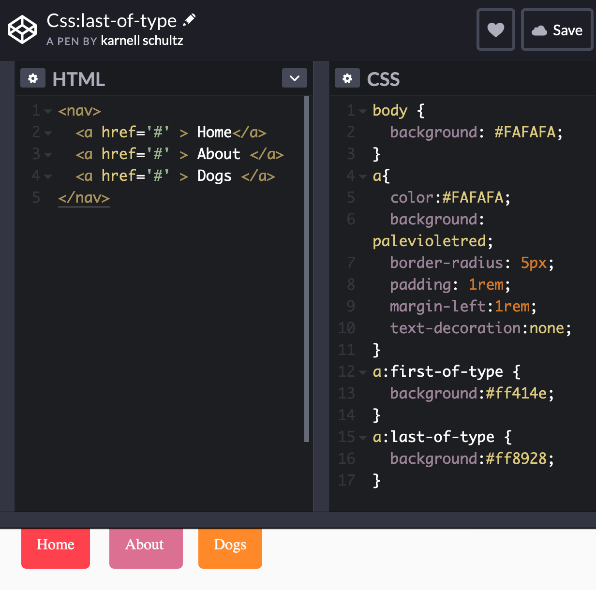

# CSS:last-of-type

## Background info

People say learning CSS is easy. I disagree. For me CSS is firmly in the "easy to start, difficult to master" zone.

CSS has quickly become one of my favorite web technologies. That's partly because it's so underrated, but mostly because it can do so much! In this article I hope to show you one little trick that CSS can do, that's the :first-of-type & :last-of-type [pseudo-classes](https://www.w3schools.com/css/css_pseudo_classes.asp).

### who is this for?

- CSS Newbies
- CSS Vets
- Anyone using CSS and looking for a new trick to add to their toolbox.

## :last-of-type

The `:last-of-type` selector allows you to target the last occurrence of an element within it's container element.

### How it it useful?

Take this example code block of an HTML nav bar:

    <nav>
      <a href='#' > Home</a>
      <a href='#' > About </a>
      <a href='#' > Projects </a>
    </nav>

In this example the `<nav/>` is the container. If we wanted to target the first element within the nav, which is the "Home" `<a/>`. We could use the `a:first-of-type` selector like this:

```
a:first-of-type {
  background:#ff414e;
  }

a {
  color:#FAFAFA;
  background: palevioletred;
  border-radius: 5px;
  padding: 1rem;
  margin-left:1rem;
  text-decoration:none;
}
```

Below is the full example of how to use `:first-of-type` & `:last-of-type`.



### Final notes

[Browser support - :first-of-type and :last-of-type](https://caniuse.com/#search=%3Alast-of-type)

🌍 Thanks 🌍
